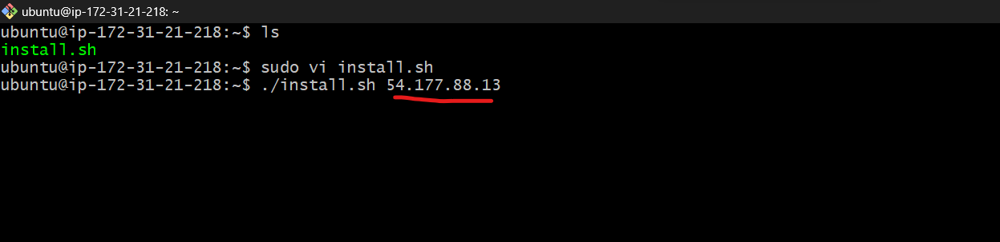

# Automating-Loadbalancer-Configuration-With-Shellscripting
Deployment of Nginx as a Load balancer using shell script

## Deploying and configuring the webservers

we need to codify the process we need to deploy in the shell scripting.

__Follow the steps below to run the script :__

__step 1:__ provision an Ec2 instance running on ubuntu 20.04.

Result:

__step2:__ open port 8000 to allow traffic from anywhere using the security group.

Result:

__step 3:__ connect to the webserver via the terminal using SSH client.

Result:

__step 4:__ open a file

Results:

__step 5:__ Run the shell script using this command: `./install.sh 54.177.88.13 (your public_ip address)`

Results:

__Deploying and configuring Nginx load balancer__

we need to provision an Ec2 instance `Nginx-loadbalancer` running ubuntu 22.04 and then open port 80 using the security group.

Results:

__step1:__ connect to your web browser using SSH client 

__step2:__ On your terminal, open a file `nginx.sh` and change the permission on the file to make it executable.

__step3:__ Run this command `sudo vi nginx.sh` and paste your file then close the file by typing `Esc shift + :wq!`.

First digits is the public IP address of the EC2 instance where Nginx is installed.

Second digits is the URL and port number of the first webserver to which the load balancer will distribute traffic.

Third digits is the URL and port number of the second webserver to which the load balancer will distribute traffic.

Results:

Result for webserver 1:

Result for webserver2:

Result for loadbalancer:

